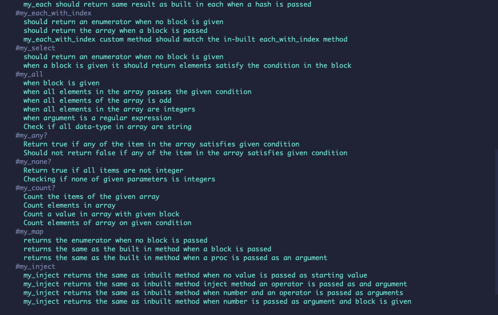

# My Custom Enumerable Methods

## Content

<a text-align="center" href="#about">About</a>&nbsp;&nbsp;&nbsp;|&nbsp;&nbsp;&nbsp;
<a href="#method">Methods</a>&nbsp;&nbsp;&nbsp;|&nbsp;&nbsp;&nbsp;
<a href="#ins">Installing</a>&nbsp;&nbsp;&nbsp;|&nbsp;&nbsp;&nbsp;
<a href="#set">Setup</a>&nbsp;&nbsp;&nbsp;|&nbsp;&nbsp;&nbsp;
<a href="#with">Built with</a>&nbsp;&nbsp;&nbsp;|&nbsp;&nbsp;&nbsp;
<a href="#ldl">Live Demo</a>&nbsp;&nbsp;&nbsp;|&nbsp;&nbsp;&nbsp;
<a href="#author">Author</a>

## About 

This project involvedd creating custom enumerable methods and testing built methods with Rspec.

<h3>Methods </h3>
<h4>The custom methods created are listed below:</h4>
<li>my_each</li>
<li>my_each_with_index</li>
<li>my_select</li>
<li>my_all?</li>
<li>my_any?</li>
<li>my_none?</li>
<li>my_count</li>
<li>my_map</li>
<li>my_inject</li>

## 🔧 Built with

- Ruby
- RSpec

## 🔴 Live Demo 

## 🔨 Setup 

- Fork the repo to your remote repository.
- Clone or download the repository to a local directory on your computer.

## 🛠 Installing 

- run npm install to install the dependencies for the project
- run bundle init to create a Gemfile
- run bundle install to install the gems

## ✒️ Authors 

👤 **Marshall Akpan**

- Github: [uimarshall](https://github.com/uimarshall)
- Twitter: [uimarshall](https://twitter.com/uimarshall)
- Linkedin: [Marshall Akpan](https://www.linkedin.com/in/marshall-akpan-19745526/)

👤 **Maryjane Akpagbue**

- Github: [Maryjanee](https://github.com/Maryjanee)
- Twitter: [Maryjane Akpagbue](https://twitter.com/alfredmaryjane)
- Linkedin: [Maryjane Akpagbue](https://www.linkedin.com/in/maryjane-akpagbue-1500b7173/)

👤 **Ahmad Chata**

- Github: [ahmadchata](https://github.com/ahmadchata)
- Twitter: [ahmadchata](https://twitter.com/ahmadchata)
- Linkedin: [Ahmad Chata](https://www.linkedin.com/in/ahmad-chata-957b9b51/)

## 🤝 Contributing

Contributions, issues and feature requests are welcome!

Feel free to check the [issues page](https://github.com/uimarshall/enumerable-methods/issues).

## 👍 Show your support

Give a ⭐️ if you like this project!

## :clap: Acknowledgements

- Microverse
- The Odin Project

[Ruby enumerable documentation here:](https://ruby-doc.org/core-2.7.1/Enumerable.html) 
